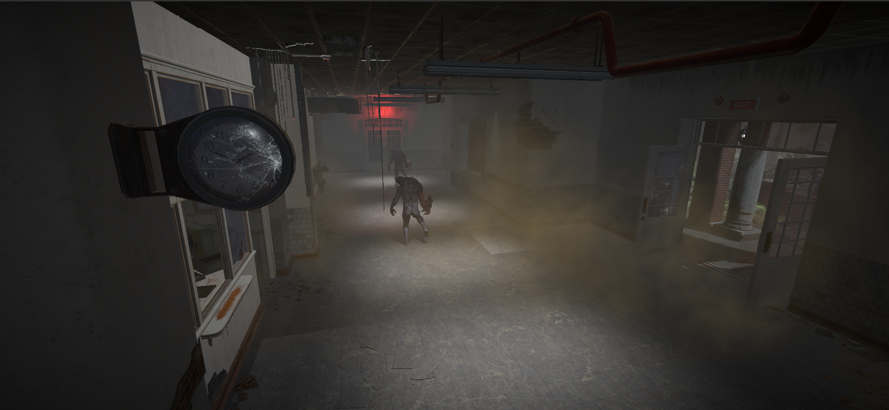
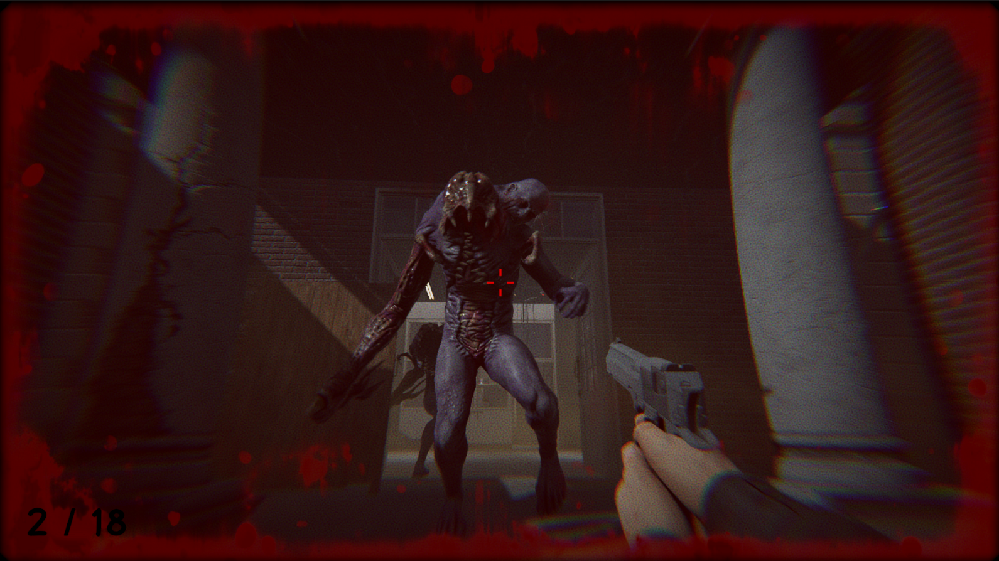
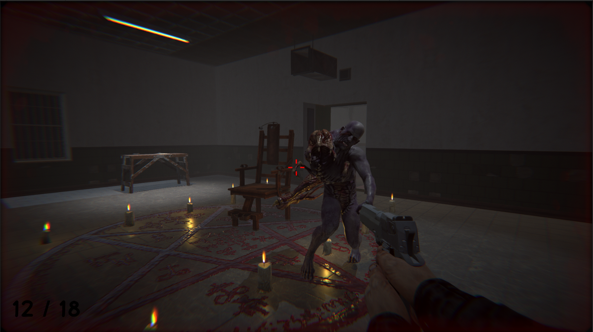
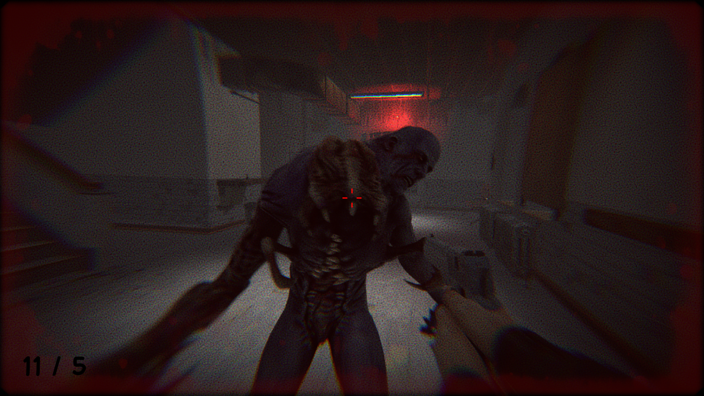
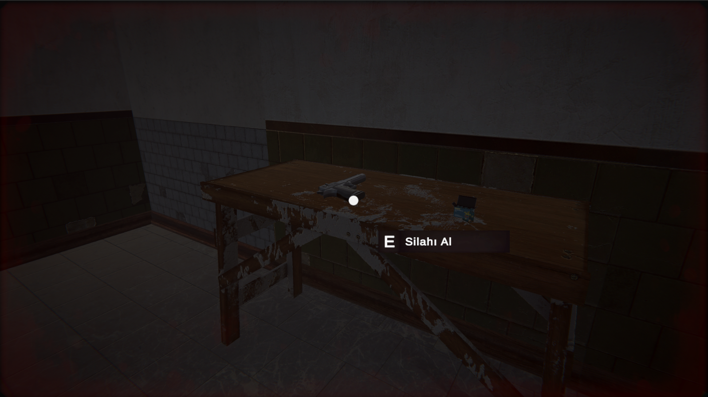

# Unity Horror Game: The Asylum

## 📖 Proje Hakkında

Bu proje, Unity Oyun Motoru kullanılarak geliştirilmiş **Birinci Şahıs Nişancı (FPS)** türünde bir korku oyunudur. Oyuncu, karanlık sırlarla dolu terk edilmiş bir akıl hastanesinde uyanır ve buradan kaçmaya çalışırken hem bulmacaları çözmeli hem de peşindeki varlıklarla mücadele etmelidir.

Proje; atmosferik ışıklandırma, yapay zeka (AI) düşman takibi, envanter yönetimi ve etkileşimli hikaye anlatımı üzerine odaklanmaktadır.

## 🎮 Oynanış Özellikleri

Bu proje aşağıdaki temel mekanikleri içermektedir:

- **FPS Kontrolleri:** Akıcı karakter hareketi, koşma, eğilme ve zıplama mekanikleri.
- **Etkileşim Sistemi:** Kapıları açma, dolapları inceleme ve fizik tabanlı objeleri hareket ettirme.
- **Ateş Etme & Silah Mekaniği:** Nişan alma, ateş etme, mermi yönetimi ve reload (şarjör değiştirme) sistemleri.
- **Düşman Yapay Zekası (AI):** Oyuncuyu gören, sesini duyan ve onu takip edip saldıran yaratıklar (NavMesh Agent kullanımı).
- **Not Toplama Sistemi:** Hikayeyi derinleştiren, etrafa gizlenmiş notları bulma ve okuma arayüzü.
- **Atmosferik Ortam:** El feneri kullanımı, dinamik ışıklandırma ve korku atmosferine uygun ses efektleri.

## 📸 Ekran Görüntüleri

Oyunun atmosferini ve mekaniklerini gösteren bazı görseller:

| | |
|:---:|:---:|
|  |  |
|  |  |
|  |  |


## 🕹️ Kontroller

| Tuş | Eylem |
| :--- | :--- |
| **W, A, S, D** | Hareket |
| **Mouse** | Etrafa Bakma |
| **Sol Tık** | Ateş Etme |
| **Sağ Tık** | Nişan Alma |
| **R** | Şarjör Değiştirme (Reload) |
| **E** | Etkileşim (Kapı Açma / Eşya Toplama) |
| **Shift** | Koşma |

## 🛠️ Kullanılan Teknolojiler

- **Oyun Motoru:** Unity 2021.3 (veya senin sürümün neyse onu yaz)
- **Dil:** C#
- **AI:** Unity NavMesh
- **Grafik:** Standart Pipeline
- **IDE:** Visual Studio

## 🚀 Kurulum

Projeyi kendi bilgisayarınızda çalıştırmak için:

1. Bu repoyu klonlayın:
   ```bash
   git clone [https://github.com/lutfubedel/Unity_HorrorGame.git](https://github.com/lutfubedel/Unity_HorrorGame.git)
